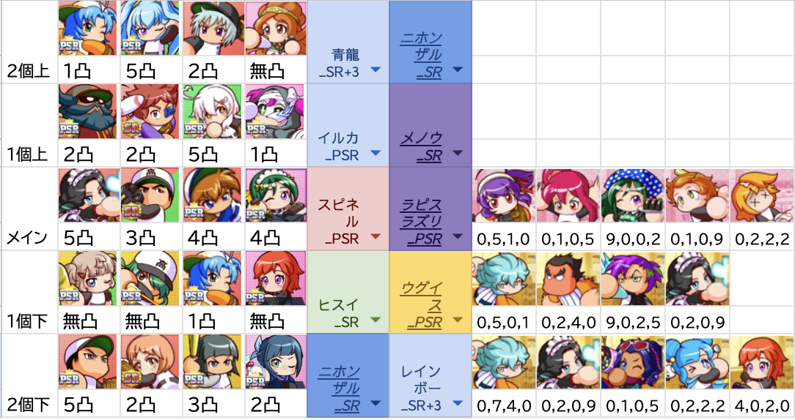
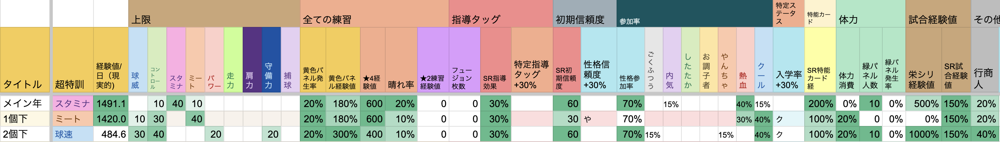

この記事はゲーム栄冠クロスにおいて[2025/3/2のチーム育成](https://x.com/kunisada00eikan/status/1896223160317645119)(当時一番総合力が高いチーム)の編成を解説する記事です

持ちキャラが特に強いわけではないのに試走で結果が出たので編成が優れていそうということで箇条書きですがシェアしたいと思います。（1個下ダルビッシュスカウト失敗しているので代用編成な事に注意）

### 編成

### ステータス推移

### 総合力推移

### 投手最終ステータス

### 野手最終ステータス

### 器材経験値と性格ボーナス

# 目次
- [目次](#目次)
- [キャラクター解説](#キャラクター解説)
  - [2個上](#2個上)
    - [十六夜瑠奈、久遠、みずき](#十六夜瑠奈久遠みずき)
  - [1個上](#1個上)
    - [天音、嵐丸](#天音嵐丸)
    - [嵐丸](#嵐丸)
    - [天音](#天音)
    - [堂江](#堂江)
  - [メイン](#メイン)
    - [ダリア](#ダリア)
    - [守](#守)
    - [イチロー](#イチロー)
  - [1個下](#1個下)
    - [あかり東條](#あかり東條)
    - [東條](#東條)
    - [みずき](#みずき)
  - [2個下](#2個下)
    - [ダルビッシュ](#ダルビッシュ)
    - [美多村](#美多村)
    - [須々木](#須々木)
  - [マネージャー](#マネージャー)
    - [戸内](#戸内)
    - [ラミィ](#ラミィ)
    - [袴明星](#袴明星)
    - [こころ](#こころ)
    - [津野田](#津野田)
  - [相性が良さそうだけど今回は採用しなかったキャラ](#相性が良さそうだけど今回は採用しなかったキャラ)
    - [2個上阿麻](#2個上阿麻)
    - [1個上荒方](#1個上荒方)
    - [メイン年鈴本、夢城](#メイン年鈴本夢城)
    - [1個下向日葵](#1個下向日葵)
    - [1個下冴木](#1個下冴木)
    - [2個下神高](#2個下神高)
    - [2個下十六夜満](#2個下十六夜満)
- [コーチ編成解説](#コーチ編成解説)
  - [メイン年 スタミナ140編成](#メイン年-スタミナ140編成)
  - [1個下ミート140コントロール130](#1個下ミート140コントロール130)
  - [2個下コントロール140他](#2個下コントロール140他)
- [立ち回り解説](#立ち回り解説)
  - [投手性格・練習指示](#投手性格練習指示)
  - [野手性格・練習指示](#野手性格練習指示)
  - [野手性格](#野手性格)

# キャラクター解説
## 2個上
### 十六夜瑠奈、久遠、みずき
- 変化とローラーは超特訓で不利なので2個上に多めが良い。今回は2個上に変化2枚。
- 器材出してくれれば誰でもよかったけどメインpがほぼクールなのでコントロール性格ボーナスの2人。
- みずきを借りた方が性格ボーナス増えたけど、変化器材出現率の方が大事なので瑠奈を借りた。
- モブ器材変化強かったら変化3枚でも良いかも

## 1個上
### 天音、嵐丸
- スタミナ枠
- 1年でスタミナ140に近づけたいので秋以降にもスタミナ上げられるようにローラーとハードル。
- ローラーは2%のキャラしか持ってないので5凸でハードル4%の天音で出現率補う形。
- スタミナ138くらいは行くと思う。(今回は日数計算ミスと、器材ハードルローラー共に弱かったので136でした)

### 嵐丸
- ローラーなら割と誰でもいい
- 内気参加率15%だけど、SR指導効果の編成ではないのでローラーキャラの参加率はそこまで気にしなくていいと思う。
- 鉄人が強いから嵐丸を採用。（sr200%アップのコーチ編成なので。）

### 天音
- 結構噛み合ってるキャラ。
- 天音は性格ボーナスミートでコーチ編成のクール入学率と合わせて1個下でミート140狙いやすくなるのが強い。
- ハードルはスタミナ上げつつ超特訓邪魔しないのが偉い。
- 1個上2個上は投手多めにするのが基本とはいえモブ野手も入学するので一枚入れると器材経験値増やせるだろうという意図（今回は全然強化できなかった。）
- お調子者なのでイルカのローラー強化発動しやすくなる（今回は半年しか発動しませんでした←お調子者5人だったのでそれもバグで発動してなかったっぽい。）
- お調子者参加率が無いコーチ編成だから高い指導効果を活かしづらいのが惜しいところ。

### 堂江
- 割と誰でもいい枠
- モブ器材次第でバランス見る感じでいいと思う。
- 熱血参加率で守とのダブルタッグで1個下で球威110まで上げておくために採用。（逆に110までしか上げられないので、いらない説もある。）
- 大越コーチ間違えて熱血参加率30%までとってしまったからどうせならという理由が強いかも。

## メイン
### ダリア
- 最強だと思う。
- チーム育成は特にフュージョンが強い。そしてフュージョンで一番強くなるのは100%参加しているダリア自身。という発想でメイン年。ダリアから編成考察はスタートした。
- 5凸は守とモブpのコントロールを上げやすくなるのが強かった。イチローや夢城ならダリア無凸でも（自分は1凸）参加率のおかげで上げやすいけど、参加率無いキャラのコントロールを上げるのはフュージョン枚数多い方がやりやすい。野手の守備120もやりやすくなるので、チーム育成は結局5枚フュージョンが強い気がする。
- コントロール練習指示は少なくて良くてほぼ変化練習で良い（今回はチキってまあまあコントロール指示してしまった。）

### 守
- コントロール3枚にするとすぐに上限頭打ちになるので1枚クールマッスラー挟む形。
- 守自身はマッスラーばかりするので、コントロール指示の期間は長めにしてバランスをとる。
- （自分の手持ちだと一番凸してるから入れたがり。）

### イチロー
- クールコントロールキャラとして採用。
- sr指導効果高く無いコーチ編成なので自身が参加して練習参加によってコントロールを上げていく形。
- 今回の編成ではばっちりハマってるというほどでも無い。
- ダリア同様コントロール指示少なくて良い。

## 1個下
### あかり東條
- いろんなパターン考えたが結局フュージョンが強いんじゃねということで1個下2枚野手
- やんちゃ初期信頼度もある編成なので、早い時期からフュージョンできる
- 超特訓の必要ポジションでも有利
- ラピスラズリとスピネルのおかげてクール多いだけでダブル恩恵
- 自身はミート性格ボナ乗って140目指しやすいのと、特打でミートサポートもできるのが強い。
- 最終年に球威130に近づけるサポートの意図もあったが、今回は投手があまり筋力フュージョンに参加してくれなかった。

### 東條
- マキシあんこは持ってない。
- クール参加率40%のコーチ編成使っているのと、守備120安定する東條は編成のはまり具合だけは抜群。
- 地味にパワヒアーチスト配れると試合で広角打法付けやすくなる。(12/14人、試合で広角打法付きました）

### みずき
- この枠はダルビッシュを借りる予定だった
- この年からコン130まで上げれるので器材出現率を増やす意図
- コーチ編成でやんちゃ初期信頼度も乗る年
- ダルビッシュは器材経験値、指導効果、参加率とまるで性能が違うのでダルビッシュにしたかった。
- 練習弱くなった分コントロール指示が増えて結果変化量が減ったと思う。

## 2個下
### ダルビッシュ
- この枠はもう一枚コース的当て入れることで5枚フュージョン待ちやすくする枠。
- 1個下でダルビッシュスカウトできてればみずきか神高がいい。
- 神高の方がボーナス強いけど、みずきはやんちゃ参加率乗るのと、初期信頼度高いからタッグできるし、性格ボナ増やせるので、守とモブpがフュージョン参加しなかった時の保険もできて相性だけは良い

### 美多村
- ダルビッシュの超強タッグができなくなってしまったのでコントロール140取り切るために器材と性格ボーナス両方を考えて美多村。
- 地味にsrド根性でそこそこ強い。（sr特能100%のコーチ編成）
- 1個下でダルビッシュがスカウトできてればマッスラーキャラを入れて球威120後半目指してたと思う。（マッスラー増やすと守がマッスラーばかりしてフュージョン参加しなくなる説はある）

### 須々木
- マッサージチェア枠
- 守備性格ボーナスの十六夜満の方が良いけど持ってない。
- マッサージチェアの弱いところは秋以降の★4練習出現率が下がることだけど、最終年に入れればそれは無くなる。
- 手持ちに5凸が多くて器材出現率高ければ1個下に入っていても強いのかも。

## マネージャー
- 基本そんなに大きく変わるわけでは無い
- 青、紫、紫でニホンザル、メノウ、ラピスラズリを強化する事を考えた編成。

### 戸内
- モブp熱血になった場合半年間スタミナ上げやすい。
- （熱血にはならなかったので意味なかった）

### ラミィ
- イルカ使うのでお調子者増やしてローラー強くする目的（バグで意味なかったらしい）
- 信頼度と調子のイベントがちょっと強い。
- 不屈の魂被りまくってるのでそこはシナジーなし
- 地味に投手金特付きやすくなる

### 袴明星
- ボーナスがちょっと強い。黄色パネル増える。したたか入学率はちょっと邪魔。

### こころ
- モブpがごくふつうになったので性格ボーナス発生率目的

### 津野田
- パワー低いモブ野手にやんちゃが多かったから性格ボーナス発生率目的

## 相性が良さそうだけど今回は採用しなかったキャラ
### 2個上阿麻
- 変化キャラかつ性格ボーナススタミナ
- 性格ボーナスはモブpにしか効果ない
- 性格ボーナスコントロールで固めたらどれくらい上がるか見たかったので今回は見送った
### 1個上荒方
- 個別練習性格ボーナスミート
- チェアで投手野手両方強化しやすい
- 器材出現率下がるのを嫌って採用しなかった
### メイン年鈴本、夢城
- 鈴本は練習参加経験値が高いのでイチローより強い可能性がある。後から気づいたので元々選択肢になかった
- 夢城は持ってない
### 1個下向日葵
- ミート140安定させる目的で入れられる
- 性格ボーナスミート
- 熱血参加率30％のコーチ編成＋高い指導効果でシナジー
- 特打も地味に強い
- 最終年マシン打撃が完全に無駄になる
- 余った経験値を他ステータスの練習指示に当てることで総合力伸ばせるが、他の野手は練習参加したかしてないかでステータス変わりすぎるので、管理が難しい
### 1個下冴木
- 高いミート性格ボーナス+自身もごくふつうで恩恵を受けられる
- 特守も強いので一枚入れられるのは大きい気がした。
- 大越コーチを0222にして捕球上限を取れるが、上限いったところで10しかないし、最終年いやしのひとときが無駄になるのが難しいところ。
### 2個下神高
- 器材経験値目当てで入れるのはあり
- タッグ組めないし、性格ボーナスないし、参加率ないのでシナジーがあるわけではない。
### 2個下十六夜満
- 守備の性格ボーナス強いので絶対須々木より強い。
- が持ってないので須々木になった。

# コーチ編成解説

基本的構成は
1. 超特訓で140+練習そこそこ
2. 超特訓で140+練習そこそこ
3. 上限とりつつ練習強化

- という構成。150にするための極端な召集がないので、組みやすかった。
- 全部黄色パネル発生率20%で倍率は180%-180%-300%
- 超特訓しつつ強い黄色パネルを踏むことが求められるので、すごろくが難しくて楽しい。
- コントロールは110-130-140と徐々に上げていけるのが地味に強い。
- スピネル、ラピスラズリ、性格ボーナスミートが大事なので、自分探しは全部買うのが基本
## メイン年 スタミナ140編成
- どの上限を取るかは非常に悩ましいところだが、1年できっぱり伸ばさなくなることから練習が強くないスタミナからが良さそうだったのでスタミナ140。
- 明星の超特訓も効率が良い
- 140+強い超特訓とりつつ、黄パネル180%-20%を実現できる編成は実はそんなに多くないと思う。
- 聖のポイント振りは0501と0411で迷ったが、初年度は自分探しいっぱい使えると思ってクール入学率を諦めた。
## 1個下ミート140コントロール130
- 上限はなんでもいいと見せかけて打てないと栄冠シリーズ負けるし特能もつけづらいのでミート編成。
- 吹奏楽のいいところはコントロール上限30とクール参加率40%が自然と取れるところ。
- 伊能のクール入学率が結構重要で、
  - 天音の性格ボーナスを半年間しっかり恩恵受けることで140が安定する。
  - スピネル、ラピスラズリが発動しやすくなる。
  - 最終年に守備120が安定する。
## 2個下コントロール140他
- コントロール140とりながら練習を強くして、取れそうな上限を増やすという構成
- 黄色パネル300%-星4経験値400なので、黄色パネル踏めるかどうかでまるで経験値が違う。
  - 4.5枚フュージョンとかでも黄色パネル踏めないならする価値ないレベルなので注意
- 3つのコーチ編成の中で一番改良・カスタマイズの余地が大きい。手持ち次第で最適なパターンが変わると思う。
- 今回は球威130-パワー120-守備120だったが、球威123とかで止まってしまったので、130-120にして練習or超特訓強化した方が強い説がある。

# 立ち回り解説
試走だったので詰めきれてない部分も多かったが重要なことは主に4つ
- 性格ボーナス乗らない練習はしたくないので自分探しで性格変えまくる
- 上限ギリギリで上げつつ練習指示でできるだけ他の経験値に変える
- メイン年と1個下は超特訓の日数計算して大きくロスしないこと（今回はメイン年で失敗しました）
- 強い練習を黄パネルかつ育てたい選手、ステータスで練習参加する日数を増やす

## 投手性格・練習指示
- モブpの性格がごくふつうになった時点で野手の性格変える事にシフトしました。（本当は熱血にしたかった。）
- 初年度スタミナ指示が多いのは効率が良いことではないので、ここは改良の余地がありそうです（今回はローラーハードルの器材が弱かった。）
- モブpは最終年ももう少し球威指示して700%を超えている性格ボーナスの恩恵を受けさせた方が良かったかもしれません。練習参加が少なかったので、どのみち全体的に足りてないですが、、、

## 野手性格・練習指示
- 全体的に性格ボーナスの恩恵を受けている期間が長いのがわかると思います。

## 野手性格
- かなり変えているのがわかると思います
- （性格だけはデータ手動入力だったので入力漏れやミスがありそうです）

